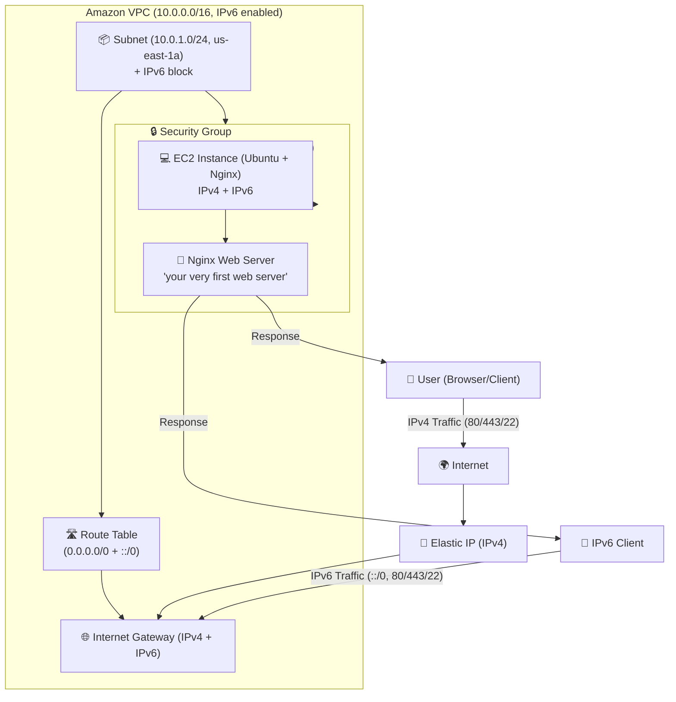

```mermaid
flowchart TD

  subgraph VPC["Amazon VPC (10.0.0.0/16, IPv6 enabled)"]

    IGW["🌐 Internet Gateway (IPv4 + IPv6)"]
    RT["🛣️ Route Table\n(0.0.0.0/0 + ::/0)"]
    SUBNET["📦 Subnet (10.0.1.0/24, us-east-1a)\n+ IPv6 block"]

    subgraph SG["🔒 Security Group\n(Allow 22, 80, 443 for IPv4 & IPv6)"]
      EC2["💻 EC2 Instance (Ubuntu + Nginx)\nIPv4 + IPv6"]
      Nginx["📄 Nginx Web Server\n'your very first web server'"]
    end

    SUBNET --> SG
    SG --> EC2
    EC2 --> Nginx

    RT --> IGW
    SUBNET --> RT

  end

  User["👤 User (Browser/Client)"]
  Internet["🌍 Internet"]
  EIP["🔑 Elastic IP (IPv4)"]
  IPv6User["👤 IPv6 Client"]

  %% Flows
  User -->|"IPv4 Traffic (80/443/22)"| Internet
  Internet --> EIP --> IGW

  IPv6User -->|"IPv6 Traffic (::/0, 80/443/22)"| IGW

  Nginx -->|"Response"| User
  Nginx -->|"Response"| IPv6User


```
